# Bertelsmann Scholarship 2020 Data Track Learning Progress
------------------------------------------------------------

#### Hey there, This a record of my learning progress on the Bertelsman scholarship data track. It also contains my progress on fulfilling the 60 days of udacity challenge. I took the pledge on December 14, 2020 but I could not keep up with it so I decided to start over from the beginning starting on January 26th, 2021. I also decided to review the entire course in order to refresh my memory and get a little practice in with alteryx.

*Credits: Unless specified, all images were gotten from Bertelsman scholarship data challenge course: Introduction to Problem Solving with Advanced Analytics Nanodegree Program by Udacity*

## DAY 1 (26/01/2021) | The journey begins

* Restarted the pledge and reviewed lesson 1.
* The basis of this lesson is to use the **Cross Industry Standard Process for Data Mining (CRISP-DM)** as a **Problem Solving Framework** for our Analysis.
* CRISP-DM consists of the following steps: 
  1. Business Issue Understanding
  2. Data Understanding
  3. Data Preparation
  4. Analysis/Modeling
  5. Validation
  6. Presentation/ Visualization.
* Steps of the CRISP-DM framework may be performed multiple times or restart the entire problem solving framework and revise some of the assumptions and decisions made along the way.

**Thoughts:** Don't throw all your data at your model and hope for the best

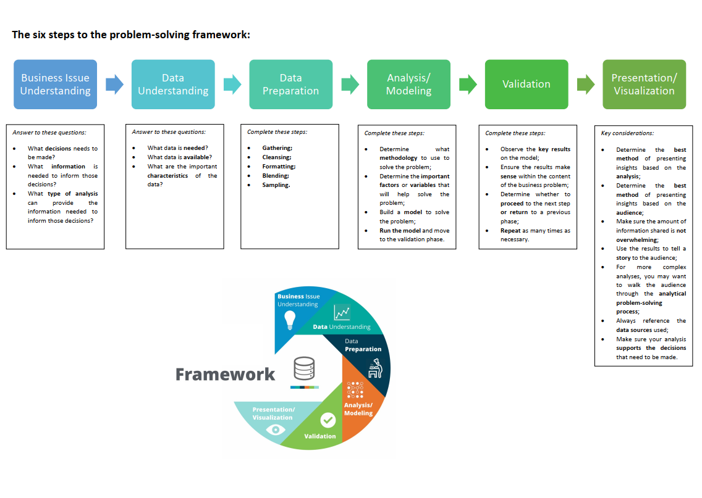

*Credit: The six steps to the problem-solving framework PDF file I Downloaded from the Bertelsmann Scholarship Data Track Slack Channel*

## Day 2 (27/01/2021) | The methodology map

* Studied lesson 2.1 - 2.8
* The methodology map is meant to be used as we work our way through the analytical problem solving framework.
* It helps us decide which methodology to use to solve a business problem.
* There are 2 types of businesss problems: Predictive and Analytical.

**Thoughts:** The type of bussiness problem you have depends on the purpose of the analysis

*Credit: Lesson2.pdf I downloaded from the Bertelsmann Scholarship Data Track Slack Channel*

## Day 3 (28/01/2021) | Types of data

* Completed Lesson 2
* The methodology map can be used to select the proper model for solving a business problem.
* There are three types of numerical data: 
    * Count
    * Categorical
    * Time-series
* There are two categories of classification data: 
    * Binary classification
    * Non-binary classification

**Thoughts:** Data comes in different types

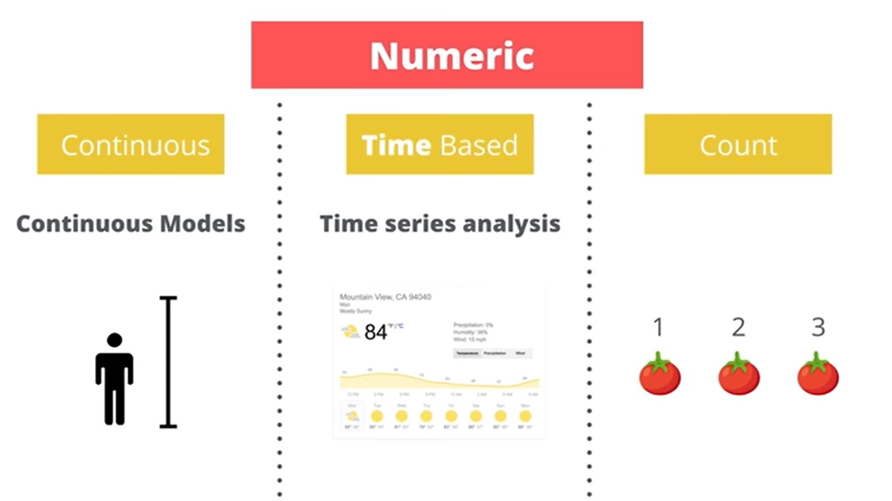

*Numeric Datatypes*

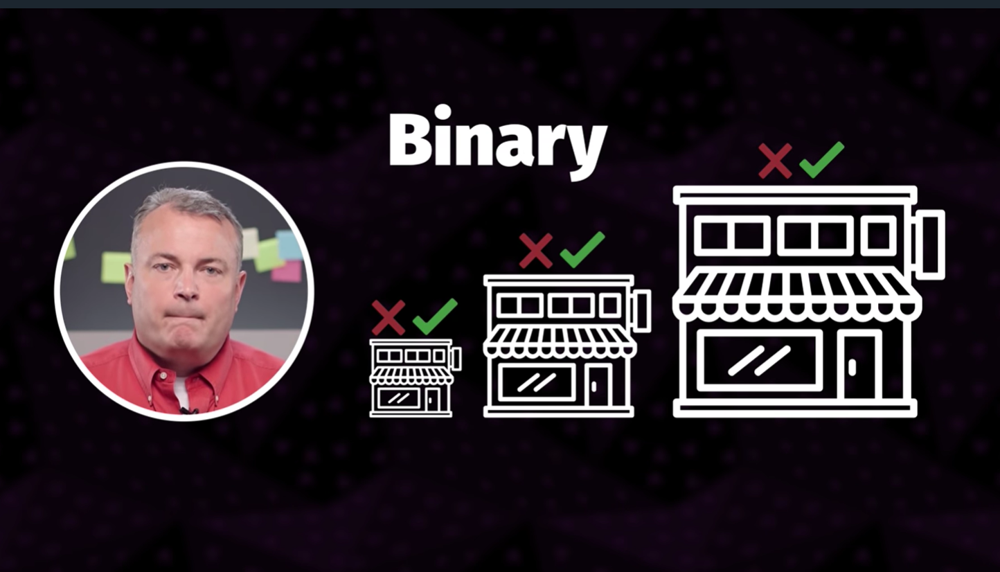

*Binary classification*

## Day 4 (29/01/2021) | Leanear Regression

* Started Lesson 3
* Learnt to perform linear Regression and multiple linear regression analysis using excel
* Learnt about correlation between predictor and target variables.

**Thoughts:** There must be correlation between predictors and target variable to make good predictions with linear regression

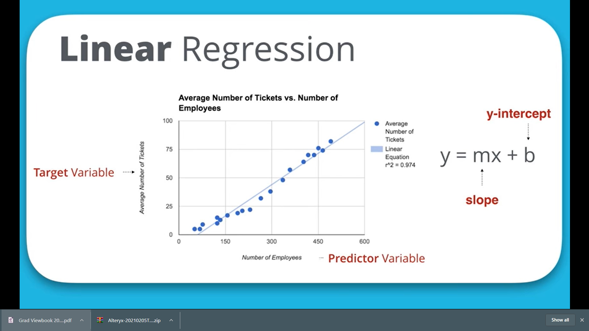

*Graph of Linear Regression*

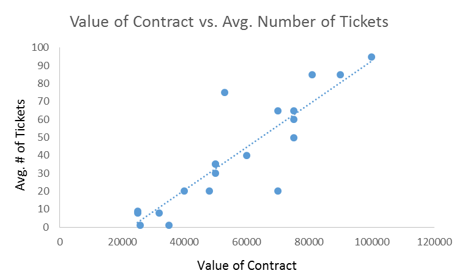

*Graph of correlation between predictor and target variables*

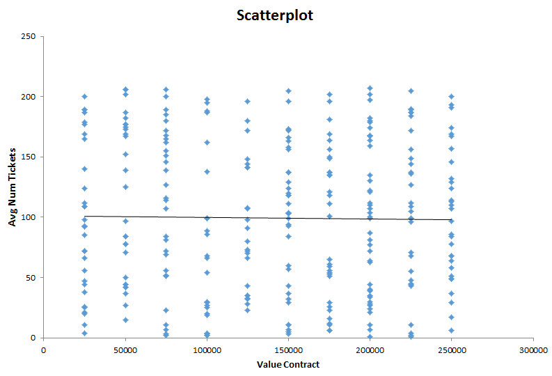

*Graph of lack of correlation between predictor and target variables*

## Day 5 (30/01/2021) | Parallel Processing

* Learnt about parallel processing in python on Dataquest.
* Parallel processing can be used to run multiple tasks at the same time.
* There are several workflows for running parallel processes such as starting and joining them simultatiously using for loops or starting each process individually at your prefered times.
* Processes take in functions and arguments for those functions as separate arguments
* Each process is has its own unshared memory
* A shared memory location (shared value) can be created for all processes using the `multiprocessing.Value()` command
* Shared values can be locked from processes preventing them from being updated by certain processes by using a **lock**

## DAY 6 (31/01/2021) | Time management

* Studied a course on Time Management

## DAY 7 (01/02/2021) | Executive Datastory Telling

 * Took a course on executive datastory telling by Data Story Acadamy
 * I learnt about the general types of executives and their prefered data story and dashboard delivery methods
 * The 5 executive types are: 
    * **The Data Geek:** loves to look at data.
    * **Emailer:** prefers getting reports through emails.
    * **Traveler:** travels a lot so their always on their phones. Send reports designed for phones.
    * **Presenter:** loves presentations. Prefers that you present your reports on a spreadsheed. 
    * **Old School** prefers reporting through PDFs & printouts
 * I learnt that understanding your executives priorities help deliver better data stories.
 * To understand them, ask questions about:
    *  what questions they wanna answer
    *  what actions they intend to take with the results
    *  what key results or metrics they are after

**Thoughts:** Learning about your excecutives would make one a more useful analyst for the company
 
## DAY 8 (02/02/2021)

* Studied Chapter 2: Flow control of automate the boring stuff with python.
* Learnt about using flowcharts and the elements of flow control.

## DAY 9 (03/02/2021)

* I spent the day downloading and installing alteryx on my windows PC

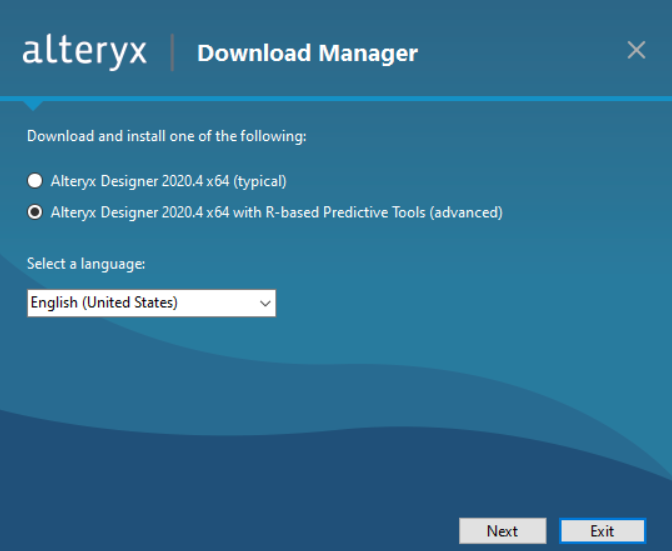

*Credit: Me*

## DAY 10 (04/02/2021)

* I learnt how to choose colors to [make your visualizations look more professional](https://blog.datawrapper.de/beautifulcolors/)
* I also learned to [never use pure black in visualizations](https://ianstormtaylor.com/design-tip-never-use-black/)
* I also learnt good ways to choose color lighting is to [check colors in greyscale](https://blog.datawrapper.de/colorblind-check/) using [Color Oracle](http://www.colororacle.org/) and [Vizcheck](http://vischeck.com/)
* I found some useful tools to help me select better colors for my visualizations. These tools are: [Adobe Color](https://color.adobe.com/create/color-wheel), [Color Calculator](https://www.sessions.edu/color-calculator/), and [Learnui color palette picker](https://learnui.design/tools/data-color-picker.html#palette) 
* I found tools to pick out image colors using [Color Picker](https://image-color.com/) and [Adobe Capture](https://www.adobe.com/products/capture.html)

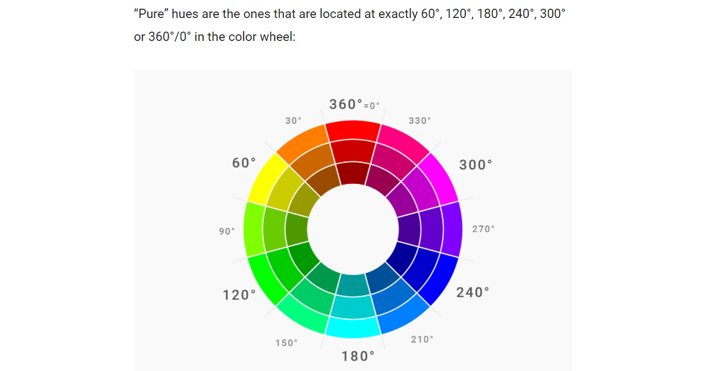

*The Color wheel*        *Image credit: [Datawrapper](https://blog.datawrapper.de/beautifulcolors/)

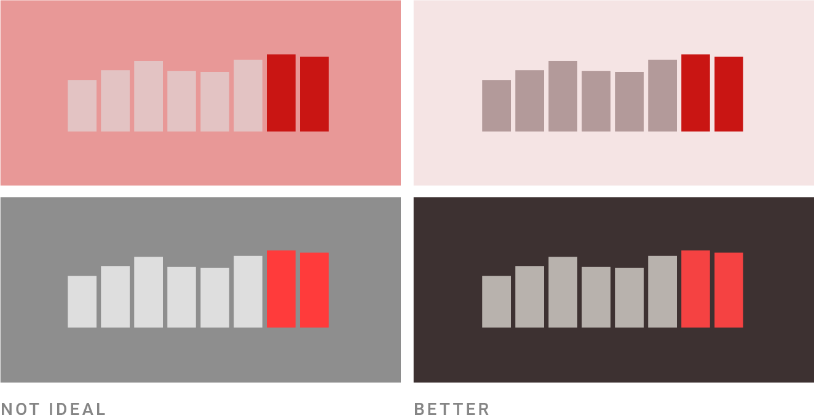

*Good colors for dark backgrounds*        
*Image credit: [Datawrapper](https://blog.datawrapper.de/beautifulcolors/)

## DAY 11 (05/02/2021)

* Learnt about r-squared and adjusted r-squared for linear and multiple linear regression analysis
* To know how good the formula is at approximating the data by calculating the coefficient of determination, or r-squared. R-squared is a coefficient between 0 and 1.
  * **closer to 1:** nearly all variance in the target variable is explained by the model
  * **closer to 0:** nearly none of the variance in the target variable is explained by the model.
  * In general, above 0.7 are considered strong and below 0.3 are considered weak.
  
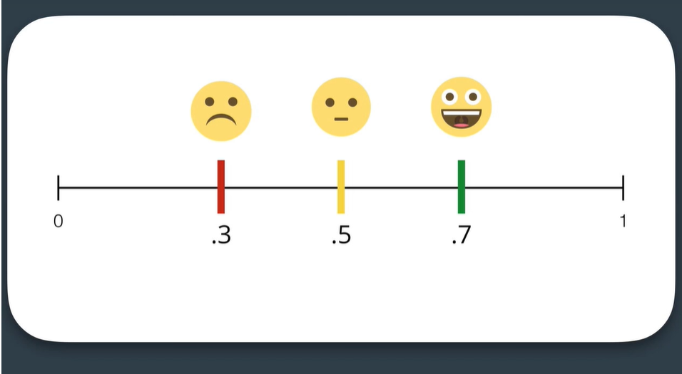

*R-Squared*

* Signed up for Alteryx trial version

## DAY 12 (06/02/2021)

* Completed lesson 3
* Learnt how to read an alteryx data analysis report

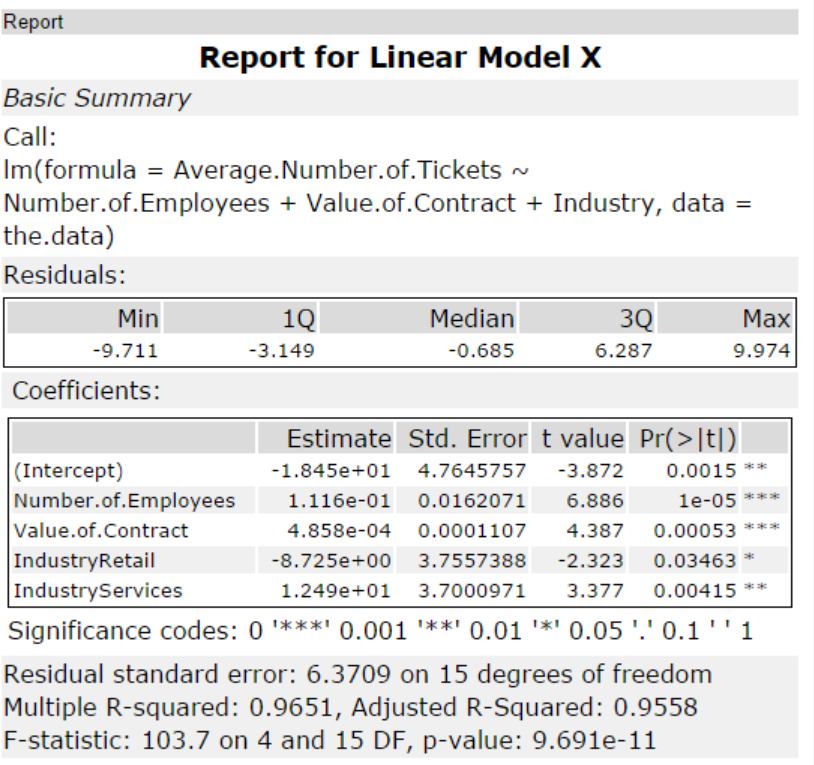

*Linear Regression Report from Alteryx*

## Day 13 (07/02/2021)

* Started on lesson 4
* Still working on developing a good model for the practice project.

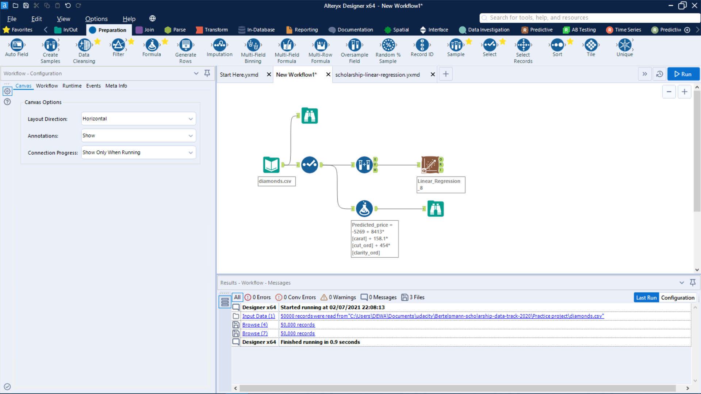

*My practice project workflow (still a work in progress)*

## Day 14 (08/02/2021)

* started creating an analytical dataset course
* Learnt about types and sources of datasets

## Day 15 (09/02/2021)

Had to go to the hospital to see my Dad
* Finally started project 1
* Checked all numerical and categorical variables for a relationship with the avg_sale_amount column
* Started working on my workflow

## Day 16 (10/02/2021)

* Completed the practice project
* Scored my model and got a bid recommendation of approximately $8,236,000 for 3000 diamonds

*Practice project workflow*

## Day 17 (11/02/2021)

* Finished lesson 1 of the creating an analytical dataset course
* Learnt about the different data types and data sources

## DAY 18 (12/02/2021)

* Continued working on project 1
* Finished a workflow for project 1

## Day 19 (13/02/2021)

* Created a working working workflow for the practice project
* Solved the question but my profit is still out of range so im going to revisit the formula i'm using

## Day 20 (14/02/2021)

* Celebrating completing a third of the challenge!!
* Finally figured out the correct formula for calculating profit. Lets move forward!!
* Happy Valentine's day

## Day 21 (15/02/2021)

* Read Chapter two of the book: Learn algorithms through problem solving
* Learnt about the diffent types of algorithms
  * Recursive algorithms: Called in themselves
  * Divide and conquer algorithms: Split problems into subproblems
  * Randomized Algorithms: Randomizes solving process
  * Exhaustive search: Most inefficient algorithms
  * Greedy algorithms: Make the best possible choice at the time

**Thoughs:** There are many kinds of algorithms

## Day 22 (16/02/2021)

* Started lesson 2 of the creating an analytical dataset course
* Learnt about the properties of dirty data and dealing with missing data. Dirty data usually contains:
    * Not correctly parsed data
    * Extra Characters
    * Misspelled Entries
    * Duplicate records
    * Incorrect data
    * Unexpected Patterns
* Learnt reasons to deal with missing data which are:
    * Prevent model bias
    * some models don't work with missing data

**Thoughts:** Its best not to perform analysis with dirty data

## Day 23 (17/02/2021) | Dealing with missing data

* Finished Lesson 2 of the creating an analytical dataset course
* You can deal with missing data by either one of the following:
  * imputing the mean, median or mode
  * multiple imputation method 
  * full information maximum likelihood
  * Delete the rows or columns with missing data (least recommended)

**Thoughts:** There are several methods of dealing with missing data

## Day 24 (18/02/2021) | Missing data

* Started lesson 3 of the creating an analytical dataset course
* Learnt about how to impute missing data
* Learnt that we should consider missing data factors such as:
  * How much data is missing?
  * How the missing data is distributed?
  * Is the missing data significant?
  * Is the missing data categorical or numerical?

**Thoughts:** Missing data can affect data in many ways.

## DAY 25 (19/02/2021) | Outliers

* Started lesson 4 of the creating an analytical dataset course
* Learned about outliers and their effects on the dataset

**Thoughts:** Outliers can affect data

## DAY 26 (20/02/2021) | Dealing with outliers

* Finished lesson 4 of the creating an analytical dataset course
* Learnt about dealing with outliers
* Learnt about performing analysis on spacial data with alteryx

**Thoughts:** Outliers may have good effects on data or not. Removing them is dependent on how much bias they introduce to the data and if they are true or not.

## Day 27 (21/02/2021) | Dealing with outliers (cont.d)

* Learned there are different ways of dealing with outliers
    * **Cross-tabbing:** taking data within a field and summarizing other data to the values within that field & create a matrix.
    * **Truncating:** changing outlier to the maximum or minimum possible value

**Thoughts:** There are ways of figuring out how best to handle data

## Day 28 (22/02/2021) | Time Series Forecasting

* Started studying Time series forecasting on udacity

## Day 29 (23/02/2021) | ETS Models

* Continued studying Time series forecasting on udacity
* Learnt about ETS models
* ETS stands for Error, Trend and Seasonality
* There are four types of ETS models:   
  * Simple Exponential Smoothing Method: Useful for No Trend, No seasonality Scenarios
  * Holt's linear Trend (Aka Double Exponential Smoothing) method: Useful for Trend, No seasonality Scenarios
  * Exponential Trend Method: Useful for Trend, No seasonality Scenarios
  * Holt's-Winters Seasonal Method: Useful for Trend and Seasonality Scenarios

**Thoughts:** ETS models are a family of models used to solve time series problems.
